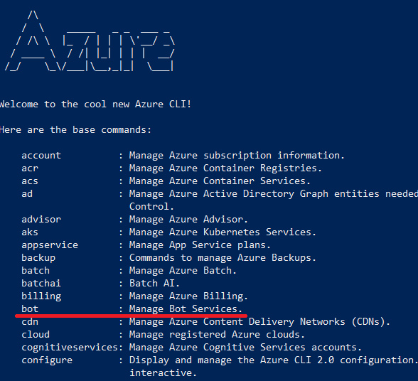
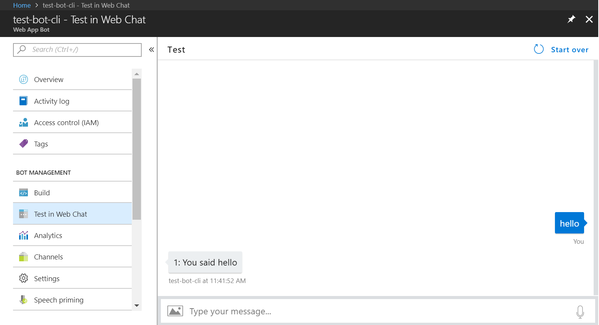
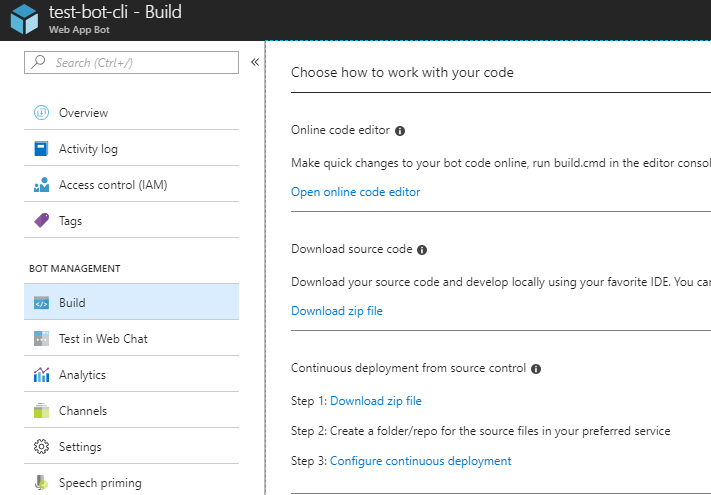

# Create bots with Azure CLI

[Bot builder tools](https://github.com/microsoft/botbuilder-tools) is a new toolset which allows you to manage and interact with your bot resources directly from the command line. 

In this tutorial we'll show you how to:

- Enable the Azure CLI bot extension
- Create a new bot using Azure CLI 
- Download a local copy for development
- Use the new MSBot tool to store all your bot resource information
- Manage, create or update LUIS and QnA models with LUDown
- Connect to LUIS an QnA maker services from the CLI
- Deploy your bot to Azure from the CLI

## Prerequisites

To enable these tools from the command line, you will need Node.js installed to your machine: 

- [Node.js (v8.5 or greater)](https://nodejs.org/en/)

## 1. Enable Azure CLI

You can now manage bots using [Azure CLI](https://docs.microsoft.com/en-us/cli/azure/?view=azure-cli-latest) like any other Azure resource. To enable Azure CLI, complete the following steps:

1. [Download](https://docs.microsoft.com/en-us/cli/azure/install-azure-cli?view=azure-cli-latest) Azure CLI if you don't already have it. 

2. Enter the following command to download the Azure Bot Extension dist package

```
az extension add -n botservice
```

>[!TIP]
> The Azure Bot Extension currently only supports v3 bots
  
3. [Login](https://docs.microsoft.com/en-us/cli/azure/authenticate-azure-cli?view=azure-cli-latest) to Azure CLI by running the following:

```shell
az login
```
Upon successful login, you will see the Azure CLI welcome screen, along with a list of available options to manage your account and resources.




 For a full list of Azure CLI commands, [click here](https://docs.microsoft.com/en-us/cli/azure/reference-index?view=azure-cli-latest).


## 2. Create a new bot from Azure CLI

Using Azure CLI and the new bot extension, you can create new bots entirely from the command line. 

```shell
az bot [command]
```
|Commands|  |
|----|----|
| create      |add a resource|
| delete     |clone a resource|
| download   | download the bot source code|
| publish   |publish to an existing bot service|
| show |show existing bot resources.|
| update| Update an existing bot Service|

To create a new bot from the CLI, you need an to select an existing [resource group](https://docs.microsoft.com/en-us/azure/azure-resource-manager/resource-group-overview), or create a new one. 

```
az bot create --resource-group "resource group", --name "name", --kind "kind" --description "description"
```
After a successful request, you will see the confirmation message **obtained msa app id and password. Provisioning bot now.** 

>[!TIP]
> If you receive an error message that the **resource group could not be found**, you may need to set your [subscription](https://docs.microsoft.com/en-us/azure/architecture/cloud-adoption-guide/adoption-intro/subscription-explainer) in Azure CLI. The Azure subscription must match the one entered when you created the resource group, to set it enter the following: 
> `az account set --subscription "your-subscription-name"`.
> To view a list of subscriptions for your account, enter the command
> `az account list`.

By default, a new .NET bot will be created. You can specify which platform SDK by specifying the language using the **-- lang** argument. Currently, the bot extension package supports C# and Node.js bot SDKs. For example, to **create a Node.js bot**:

```
az bot create --resource-group "resource group", --name "name",
--kind "kind" --description "description" --lang Node 
```
Your new echo bot will be provisioned to your resource group on Azure,to test it out simply select **Test in Webchat** under the bot management tab of your bot resource. 

 

## 3. Download the bot locally

There are two ways you can download the source code for the new bot:
- download from the Azure Portal
- download using the new Azure CLI 

To download your bot source code from the portal, simply select your bot resource, and select **Build** under bot management. There are several different options available to manage or retrieve your bot's source code locally. 



To download your bot source using the CLI, you need to specify the target directory to save your bot's source code, enter the following to download the bot source code locally:

```
az bot download --file-save-path "file-path" --name "resource name of bot" --resource-group "name of resource group"
```
For example - 


The command above allows you to download your bot's source code directly to the specified location, allowing you to develop your bot locally.


## 4. Store your bot information with MSBot

The new [MSBot](https://github.com/Microsoft/botbuilder-tools/tree/master/MSBot) tool allows you to create a **.bot** file, which stores metadata about different services your bot consumes, all in one location. This file also enables your bot to connect to these services from the CLI. The tool is available as an npm module, to install it run:

```shell
npm install -g msbot 
```

To create a bot file, from your CLI enter **msbot init** followed by the name of your bot, and the target URL endpoint, for example:

```shell
msbot init --name TestBot --endpoint http://localhost:9499/api/messages
```
To connect your bot to a service, in your CLI enter **msbot connect** followed by the appropriate service:

```shell
msbot connect [Service]
```

| Service | Description |
| ------ | ----------- |
| azure  |connect your bot to an Azure Bot Service registration|
|localhost| connect your bot to a localhost endpoint|
|luis     | connect your bot to a LUIS application |
| qna     |connect your bot to a QnA Knowledgebase|
|help [cmd]  |display help for [cmd]|

### Connect your bot to ABS with the .bot file

With the MSBot tool installed, you can easily connect your bot to an existing resource group in the Azure Bot Service by running the az bot **show** command. 

```shell
az bot show -n <botname> -g <resourcegroup> --msbot | msbot connect azure --stdin
```

This will take current endpoint, MSA appID and password from the target resource group and update the information accordingly in your .bot file. 


## 5. Manage, Update or Create LUIS and QnA services with  new botbuilder-tools

[Bot builder tools](https://github.com/microsoft/botbuilder-tools) is a new toolset which allows you to manage and interact with your bot resources directly from the command line. 

>[!TIP]
> Every bot builder tool includes a global help command, accessible from the command line by entering **-h** or **--help**. This command is available at any time from any action, which will provide a helpful display of the options available to you along with their descriptions 

### LUDown
[LUDown](https://github.com/Microsoft/botbuilder-tools/tree/master/ludown) allows you to describe and create powerful language components for bots using **.lu** files. The new .lu file is a type of markdown format which the LUDown tool consumes and outputs .json files specific to the target service. Currently, you can use .lu files to create a new [LUIS](https://docs.microsoft.com/en-us/azure/cognitive-services/luis/luis-get-started-create-app) application or [QnA](https://qnamaker.ai/Documentation/CreateKb) knowledge base, using different formats for each. LUDown is available as an npm module, and can be used by installing globally to your machine:

```shell
npm install -g ludown
```
The LUDown tool can be used to create new .json models for both LUIS and QnA.  


### Creating a LUIS application with LUDown

You can define [intents](https://docs.microsoft.com/en-us/azure/cognitive-services/luis/add-intents) and [entities](https://docs.microsoft.com/en-us/azure/cognitive-services/luis/add-entities) for a LUIS application just like you would from the LUIS portal. 

'#\<intent-name\>' describes a new intent definition section. Each line subsequent line afterwards are [utterances](https://docs.microsoft.com/en-us/azure/cognitive-services/luis/add-example-utterances) which describe that intent.

For example, you can creatue multiple LUIS intents in a single .lu file as follows: 

```
# Greeting
Hi
Hello
Good morning
Good evening

# Help
help
I need help
please help
```

### QnA pairs with LUDown

The .lu file format supports also QnA pairs using the following notation: 

```markdown
> ### ? question ?
  ```markdown
    answer
  ```

The LUDown tool will automatically separate question and answers into a qnamaker JSON file that you can then use to create your new [QnaMaker.ai](http://qnamaker.ai) knowledge base.

```markdown
> ### ? How do I change the default message for QnA Maker?
  ```markdown
  You can change the default message if you use the QnAMakerDialog. 
  See [this link](https://docs.botframework.com/en-us/azure-bot-service/templates/qnamaker/#navtitle) for details. 
  ```


You can also add multiple questions to the same answer by simply adding new lines of variations of questions for a single answer. 

```markdown
### ? What is your name?
- What should I call you?
  ```markdown
    I'm the echoBot! Nice to meet you.
  ```


### Generating .json models with LUDown

After you've defined LUIS or QnA language components in the .lu format, you can publish out to a LUIS .json, QnA .json, or QnA .tsv file. When run, the LUDown tool will look for any .lu files within the same working directory to parse. Since the LUDown tool can target both LUIS or QnA with .lu files, we simply need to specify which language service to generate for, using the general command **ludown parse <Service> -- in <luFile>**. 

In our sample working directory, we have two .lu files to parse, 'luis-sample.lu' to create LUIS model, and 'qna-sample.lu' to create a QnA knowledge base.


#### Generate LUIS .json models

**luis-sample.lu** 
```markdown
# Greeting
- Hi
- Hello
- Good morning
- Good evening
```

To generate a LUIS model using LUDown, in your current working directory simply enter the following:

```shell
ludown parse ToLuis --in <luFile> 
```

#### Generate QnA Knowledge Base .json

**qna-sample.lu**
```
> # QnA Definitions
> This is a QnA definition. Follows # ? Question: \<list of questions\> \```markdown \<Answer> ``` format

### ? How do I change the default message
```markdown
You can change the default message if you use the QnAMakerDialog. 
See [this link](https://docs.botframework.com/en-us/azure-bot-service/templates/qnamaker/#navtitle) for details. 
```

Similarly, to create a QnA knowledge base, you only need to change the parse target. 

```shell
ludown parse ToQna --in <luFile> 
```

The resulting JSON files can be consumed by LUIS and QnA either through their respective portals, or via the new CLI tools. 

## 6. Connect to LUIS an QnA maker services from the CLI

### Connect to LUIS from the CLI 

Included in the new tool set is a [LUIS extension](https://github.com/Microsoft/botbuilder-tools/tree/master/LUIS) which allows you to independently manage your LUIS resources. It is available as an npm module which you can download:

```shell
npm install -g luis-apis
```
The basic command usage for the LUIS tool from the CLI is:

```shell
luis <action> <resource> <args...>
```
To connect your bot to LUIS, you will need to create a **.luisrc** file. This is a configuration file which provisions your LUIS appID and password to the service endpoint when your application makes outbound calls. You can create this file by running **luis init** as follows:

```shell
> luis init
```
You will be prompted in the terminal to enter your LUIS authoring key, region, and appID before the tool will generate the file.  

 


Once this file is generated, your application will be able to consume the LUIS .json file (generated from LUDown) using the following command from the CLI: 

```shell
luis import application --in luis-app.json | msbot connect luis --stdin
```

### Connect to QnA from the CLI

Included in the new tool set is a [QnA extension](https://github.com/Microsoft/botbuilder-tools/tree/master/QnAMaker) which allows you to independently manage your LUIS resources. It is available as an npm module which you can download:

```
npm install -g qnamaker
```
With the QnA maker tool, you can create, update, publish, delete, and train your knowledge base. To get started, you need to create a **.qnamakerrc** file is required to enable the endpoint to your service. You can easily create this file by running **qnamaker init** and following the prompts along with your QnA Maker knowledge base ID. 

```
qnamaker init 
```


Once your .qnamakerrc file is generated, you can now connect to your QnA knowledge base to consume the knowledge base .json/.tsv file (generated from LUDown) using the following command:

```
qnamaker create --in qnaKB.json --msbot | msbot connect qna --stdin
```

## 7. Publish to Azure from the CLI

After making changes to your bot's source code, you can seamlessly publish your changes by running the following:

```
az bot publish --name "bot name" --resource-group "resource group name"
```

## References
- [BotBuilder Tools Source Code](https://github.com/Microsoft/botbuilder-tools)
- [MSBot](https://github.com/Microsoft/botbuilder-tools/tree/master/MSBot)
- [ChatDown](https://github.com/Microsoft/botbuilder-tools/tree/master/Chatdown)
- [LUDown](https://github.com/Microsoft/botbuilder-tools/tree/master/ludown)
- [Azure CLI](https://docs.microsoft.com/en-us/cli/azure/install-azure-cli?view=azure-cli-latest)


