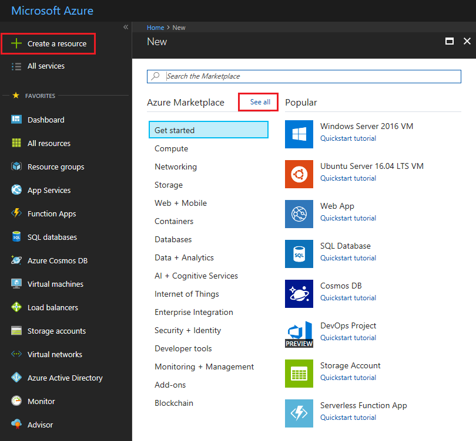
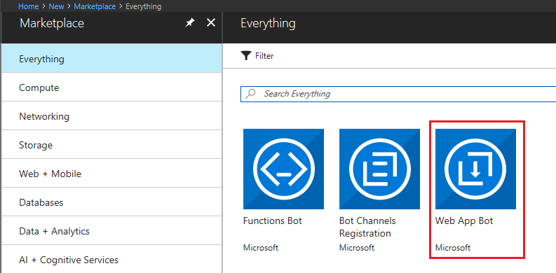
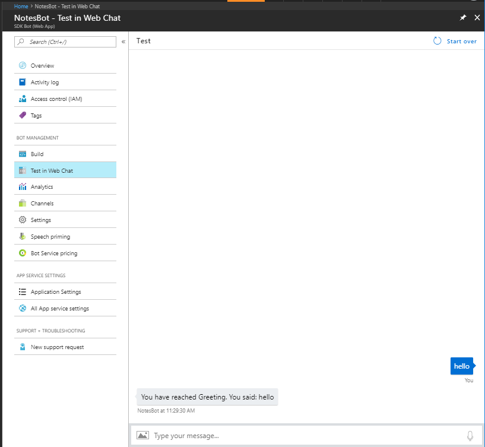
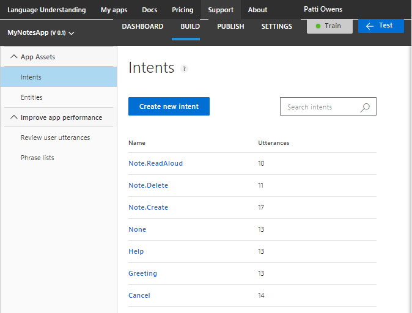
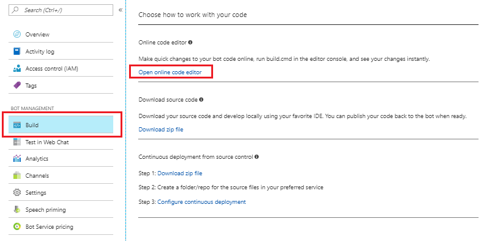
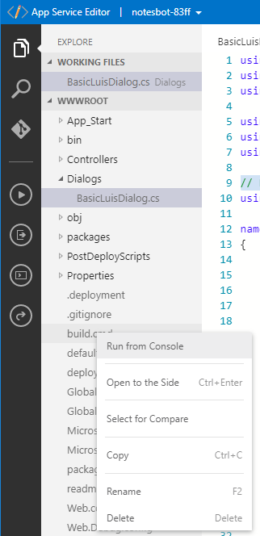

# Recognize intents and entities with LUIS 

This article uses the example of a bot for taking notes, to demonstrate how Language Understanding ([LUIS][LUIS]) helps your bot respond appropriately to natural language input. A bot detects what a user wants to do by identifying their **intent**. This intent is determined from spoken or textual input, or **utterances**. The intent maps utterances to actions that the bot takes. For example, a note-taking bot recognizes a `Notes.Create` intent to invoke the functionality for creating a note. A bot may also need to extract **entities**, which are important words in utterances. In the example of a note-taking bot, the `Notes.Title` entity identifies the title of each note.

## Create a Language Understanding bot with Bot Service

1. In the [Azure portal](https://portal.azure.com), select **Create new resource** in the menu blade and click **See all**.<!-- Start with the steps in [Create a bot with Bot Service](../bot-service-quickstart.md) to start creating a new bot service.  -->

    

2. In the search box, search for **Web App Bot**. 

    

3. In the **Bot Service** blade, provide the required information, and click **Create**. This creates and deploys the bot service and LUIS app to Azure. 
    * Set **App name** to your bot’s name. The name is used as the subdomain when your bot is deployed to the cloud (for example, mynotesbot.azurewebsites.net). This name is also used as the name of the LUIS app associated with your bot. Copy it to use later, to find the LUIS app associated with the bot.
    * Select the subscription, [resource group](/azure/azure-resource-manager/resource-group-overview), App service plan, and [location](https://azure.microsoft.com/en-us/regions/).
    * Select the **Language understanding (C#)** template for the **Bot template** field.

    

    * Check the box to confirm to the terms of service.

4. Confirm that the bot service has been deployed.
    * Click Notifications (the bell icon that is located along the top edge of the Azure portal). The notification will change from **Deployment started** to **Deployment succeeded**.
    * After the notification changes to **Deployment succeeded**, click **Go to resource** on that notification.

## Try the bot

Confirm that the bot has been deployed by checking the **Notifications**. The notifications will change from **Deployment in progress...** to **Deployment succeeded**. Click **Go to resource** button to open the bot's resources blade.

Once the bot is registered, click **Test in Web Chat** to open the Web Chat pane. Type "hello" in Web Chat.

  

The bot responds by saying "You have reached Greeting. You said: hello". This confirms that the bot has received your message and passed it to a default LUIS app that it created. This default LUIS app detected a Greeting intent.

## Modify the LUIS app

Log in to [https://www.luis.ai](https://www.luis.ai) using the same account you use to log in to Azure. Click on **My apps**. In the list of apps, find the app that begins with the name specified in **App name** in the **Bot Service** blade when you created the Bot Service. 

The LUIS app starts with 4 intents: Cancel: Greeting, Help, and None. <!-- picture -->

The following steps add the Note.Create, Note.ReadAloud, and Note.Delete intents: 

1. Click on **Prebuit Domains** in the lower left of the page. Find the **Note** domain and click **Add domain**.

2. This tutorial doesn't use all of the intents included in the **Note** prebuilt domain. In the **Intents** page, click on each of the following intent names and then click the **Delete Intent** button.
   * Note.ShowNext
   * Note.DeleteNoteItem
   * Note.Confirm
   * Note.Clear
   * Note.CheckOffItem
   * Note.AddToNote

   The only intents that should remain in the LUIS app are the following: 
   * Note.ReadAloud
   * Note.Create
   * Note.Delete
   * None
   * Help
   * Greeting
   * Cancel 

    

3.	Click the **Train** button in the upper right to train your app.
4.	Click **PUBLISH** in the top navigation bar to open the **Publish** page. Click the **Publish to production slot** button. After successful publish, copy the URL displayed in the **Endpoint** column the **Publish App** page, in the row that starts with the Resource Name Starter_Key. Save this URL to use later in your bot’s code. The URL has a format similar to this example: `https://westus.api.cognitive.microsoft.com/luis/v2.0/apps/xxxxxxxx-xxxx-xxxx-xxxx-xxxxxxxxxxxx?subscription-key=xxxxxxxxxxxxxxxxxxxxxxxxxxxxxxxx&timezoneOffset=0&verbose=true&q=`

## Modify the bot code

Click **Build** and then click **Open online code editor**.
    

In the code editor, open `BasicLuisDialog.cs`. It contains the following code for handling intents from the LUIS app.
```cs
using System;
using System.Configuration;
using System.Threading.Tasks;

using Microsoft.Bot.Builder.Dialogs;
using Microsoft.Bot.Builder.Luis;
using Microsoft.Bot.Builder.Luis.Models;

namespace Microsoft.Bot.Sample.LuisBot
{
    // For more information about this template visit http://aka.ms/azurebots-csharp-luis
    [Serializable]
    public class BasicLuisDialog : LuisDialog<object>
    {
        public BasicLuisDialog() : base(new LuisService(new LuisModelAttribute(
            ConfigurationManager.AppSettings["LuisAppId"], 
            ConfigurationManager.AppSettings["LuisAPIKey"], 
            domain: ConfigurationManager.AppSettings["LuisAPIHostName"])))
        {
        }

        [LuisIntent("None")]
        public async Task NoneIntent(IDialogContext context, LuisResult result)
        {
            await this.ShowLuisResult(context, result);
        }

        // Go to https://luis.ai and create a new intent, then train/publish your luis app.
        // Finally replace "Greeting" with the name of your newly created intent in the following handler
        [LuisIntent("Greeting")]
        public async Task GreetingIntent(IDialogContext context, LuisResult result)
        {
            await this.ShowLuisResult(context, result);
        }

        [LuisIntent("Cancel")]
        public async Task CancelIntent(IDialogContext context, LuisResult result)
        {
            await this.ShowLuisResult(context, result);
        }

        [LuisIntent("Help")]
        public async Task HelpIntent(IDialogContext context, LuisResult result)
        {
            await this.ShowLuisResult(context, result);
        }

        private async Task ShowLuisResult(IDialogContext context, LuisResult result) 
        {
            await context.PostAsync($"You have reached {result.Intents[0].Intent}. You said: {result.Query}");
            context.Wait(MessageReceived);
        }
    }
}
```
### Create a class for storing notes

Add the following `using` statement in BasicLuisDialog.cs.

```cs
using System.Collections.Generic;
```

Add the following code within the `BasicLuisDialog` class, after the constructor definition.

```cs
        // Store notes in a dictionary that uses the title as a key
        private readonly Dictionary<string, Note> noteByTitle = new Dictionary<string, Note>();
        
        [Serializable]
        public sealed class Note : IEquatable<Note>
        {

            public string Title { get; set; }
            public string Text { get; set; }

            public override string ToString()
            {
                return $"[{this.Title} : {this.Text}]";
            }

            public bool Equals(Note other)
            {
                return other != null
                    && this.Text == other.Text
                    && this.Title == other.Title;
            }

            public override bool Equals(object other)
            {
                return Equals(other as Note);
            }

            public override int GetHashCode()
            {
                return this.Title.GetHashCode();
            }
        }

        // CONSTANTS        
        // Name of note title entity
        public const string Entity_Note_Title = "Note.Title";
        // Default note title
        public const string DefaultNoteTitle = "default";
```

### Handle the Note.Create intent
To handle the Note.Create intent, add the following code to the `BasicLuisDialog` class.

```cs
        private Note noteToCreate;
        private string currentTitle;
        [LuisIntent("Note.Create")]
        public Task NoteCreateIntent(IDialogContext context, LuisResult result)
        {
            EntityRecommendation title;
            if (!result.TryFindEntity(Entity_Note_Title, out title))
            {
                // Prompt the user for a note title
                PromptDialog.Text(context, After_TitlePrompt, "What is the title of the note you want to create?");
            }
            else
            {
                var note = new Note() { Title = title.Entity };
                noteToCreate = this.noteByTitle[note.Title] = note;

                // Prompt the user for what they want to say in the note           
                PromptDialog.Text(context, After_TextPrompt, "What do you want to say in your note?");
            }
            
            return Task.CompletedTask;
        }
        
        
        private async Task After_TitlePrompt(IDialogContext context, IAwaitable<string> result)
        {
            EntityRecommendation title;
            // Set the title (used for creation, deletion, and reading)
            currentTitle = await result;
            if (currentTitle != null)
            {
                title = new EntityRecommendation(type: Entity_Note_Title) { Entity = currentTitle };
            }
            else
            {
                // Use the default note title
                title = new EntityRecommendation(type: Entity_Note_Title) { Entity = DefaultNoteTitle };
            }

            // Create a new note object 
            var note = new Note() { Title = title.Entity };
            // Add the new note to the list of notes and also save it in order to add text to it later
            noteToCreate = this.noteByTitle[note.Title] = note;

            // Prompt the user for what they want to say in the note           
            PromptDialog.Text(context, After_TextPrompt, "What do you want to say in your note?");

        }

        private async Task After_TextPrompt(IDialogContext context, IAwaitable<string> result)
        {
            // Set the text of the note
            noteToCreate.Text = await result;
            
            await context.PostAsync($"Created note **{this.noteToCreate.Title}** that says \"{this.noteToCreate.Text}\".");
            
            context.Wait(MessageReceived);
        }
```

### Handle the Note.ReadAloud Intent
The bot can use the `Note.ReadAloud` intent to show the contents of a note, or of all the notes if the note title isn't detected.

Paste the following code into the `BasicLuisDialog` class.
```cs
        [LuisIntent("Note.ReadAloud")]
        public async Task NoteReadAloudIntent(IDialogContext context, LuisResult result)
        {
            Note note;
            if (TryFindNote(result, out note))
            {
                await context.PostAsync($"**{note.Title}**: {note.Text}.");
            }
            else
            {
                // Print out all the notes if no specific note name was detected
                string NoteList = "Here's the list of all notes: \n\n";
                foreach (KeyValuePair<string, Note> entry in noteByTitle)
                {
                    Note noteInList = entry.Value;
                    NoteList += $"**{noteInList.Title}**: {noteInList.Text}.\n\n";
                }
                await context.PostAsync(NoteList);
            }

            context.Wait(MessageReceived);
        }
        
        public bool TryFindNote(string noteTitle, out Note note)
        {
            bool foundNote = this.noteByTitle.TryGetValue(noteTitle, out note); // TryGetValue returns false if no match is found.
            return foundNote;
        }
        
        public bool TryFindNote(LuisResult result, out Note note)
        {
            note = null;

            string titleToFind;

            EntityRecommendation title;
            if (result.TryFindEntity(Entity_Note_Title, out title))
            {
                titleToFind = title.Entity;
            }
            else
            {
                titleToFind = DefaultNoteTitle;
            }

            return this.noteByTitle.TryGetValue(titleToFind, out note); // TryGetValue returns false if no match is found.
        }
```

### Handle the Note.Delete intent
Paste the following code into the `BasicLuisDialog` class.

```cs
        [LuisIntent("Note.Delete")]
        public async Task NoteDeleteIntent(IDialogContext context, LuisResult result)
        {
            Note note;
            if (TryFindNote(result, out note))
            {
                this.noteByTitle.Remove(note.Title);
                await context.PostAsync($"Note {note.Title} deleted");
            }
            else
            {                             
                // Prompt the user for a note title
                PromptDialog.Text(context, After_DeleteTitlePrompt, "What is the title of the note you want to delete?");                         
            }           
        }

        private async Task After_DeleteTitlePrompt(IDialogContext context, IAwaitable<string> result)
        {
            Note note;
            string titleToDelete = await result;
            bool foundNote = this.noteByTitle.TryGetValue(titleToDelete, out note);

            if (foundNote)
            {
                this.noteByTitle.Remove(note.Title);
                await context.PostAsync($"Note {note.Title} deleted");
            }
            else
            {
                await context.PostAsync($"Did not find note named {titleToDelete}.");
            }

            context.Wait(MessageReceived);
        }
```

## Build the bot
Right-click on **build.cmd** in the code editor and choose **Run from Console**.

   

## Test the bot

In the Azure Portal, click on **Test in Web Chat** to test the bot. Try type messages like "Create a note", "read my notes", and "delete notes".
   

> [!TIP]
> If you find that your bot doesn't always recognize the correct intent or entities, improve your LUIS app's performance by giving it more example utterances to train it. You can retrain your LUIS app without any modification to your bot's code. See [Add example utterances](/azure/cognitive-services/LUIS/add-example-utterances) and [train and test your LUIS app](/azure/cognitive-services/LUIS/train-test).

> [!TIP]
> If your bot code runs into an issue, check the following:
> * You have [built the bot](./bot-builder-dotnet-luis-dialogs.md#build-the-bot).
> * Your bot code defines a handler for every intent in your LUIS app.

## Next steps

From trying the bot, you can see how tasks are invoked by a LUIS intent. However, this simple example doesn't allow for interruption of the currently active dialog. Allowing and handling interruptions like "help" or "cancel" is a flexible design that accounts for what users really do. Learn more about using scorable dialogs so that your dialogs can handle interruptions.

> [!div class="nextstepaction"]
> [Global message handlers using scorables](bot-builder-dotnet-scorable-dialogs.md)

## Additional resources

- [Dialogs](bot-builder-dotnet-dialogs.md)
- [Manage conversation flow with dialogs](bot-builder-dotnet-manage-conversation-flow.md)
- <a href="https://www.luis.ai" target="_blank">LUIS</a>
- <a href="/dotnet/api/?view=botbuilder-3.11.0" target="_blank">Bot Builder SDK for .NET Reference</a>

[LUIS]: https://www.luis.ai/
[NotesSample]: https://github.com/Microsoft/BotFramework-Samples/tree/master/docs-samples/CSharp/Simple-LUIS-Notes-Sample
[NotesSampleJSON]: https://github.com/Microsoft/BotFramework-Samples/blob/master/docs-samples/CSharp/Simple-LUIS-Notes-Sample/Notes.json