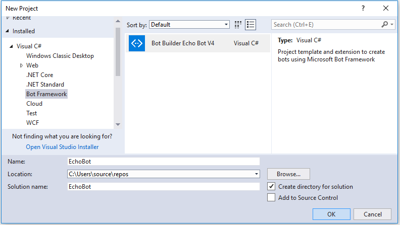

# Create a bot with the Bot Builder SDK v4 for .NET
[!INCLUDE [pre-release-label](../includes/pre-release-label.md)]

This quickstart walks you through building a bot by using the Bot Application template and the Bot Builder SDK for .NET, and then testing it with the Bot Framework Emulator. This is based off the [Microsoft Bot Builder SDK v4](https://github.com/Microsoft/botbuilder-dotnet).

## Pre-requisites
- Visual Studio [2017](https://www.visualstudio.com/downloads)
- Bot Builder SDK v4 template for [C#](https://marketplace.visualstudio.com/items?itemName=BotBuilder.botbuilderv4)
- [Bot Framework Emulator](https://github.com/Microsoft/BotFramework-Emulator/releases)
- Knowledge of [ASP.Net Core](https://docs.microsoft.com/aspnet/core/) and asynchronous programming in [C#](https://docs.microsoft.com/en-us/dotnet/csharp/programming-guide/concepts/async/index)

## Create a bot
Install BotBuilderVSIX.vsix template that you downloaded in the pre-requisite section. 

In Visual Studio, create a new bot project.



> [!TIP] 
> If needed, update [NuGet packages](https://docs.microsoft.com/en-us/nuget/quickstart/install-and-use-a-package-in-visual-studio).

## Explore code
Open Startup.cs file to review code in the `ConfigureServices(IServiceCollection services)` method. The `CatchExceptonMiddleware` middleware is added to the messaging pipeline. It handles any exceptions thrown by other middleware, or by OnTurn method. 

```cs
options.Middleware.Add(new CatchExceptionMiddleware<Exception>(async (context, exception) =>
{
    await context.TraceActivity("EchoBot Exception", exception);
    await context.SendActivity("Sorry, it looks like something went wrong!");
}));
```

The conversation state middleware uses in-memory storage. It reads and writes the EchoState to storage.  The turn count in EchoState class keeps track of the number of messages sent to the bot. You can use a similar technique to maintain state in between turns.

```cs
 IStorage dataStore = new MemoryStorage();
 options.Middleware.Add(new ConversationState<EchoState>(dataStore));
```

The `Configure(IApplicationBuilder app, IHostingEnvironment env)` method calls `.UseBotFramework` to route incoming activities to the bot adapter. 

The `OnTurn(ITurnContext context)` method in the EchoBot.cs file is used to check the incoming activity type and send a reply to the user. 

```cs
public async Task OnTurn(ITurnContext context)
{
    // This bot is only handling Messages
    if (context.Activity.Type == ActivityTypes.Message)
    {
        // Get the conversation state from the turn context
        var state = context.GetConversationState<EchoState>();

        // Bump the turn count. 
        state.TurnCount++;

        // Echo back to the user whatever they typed.
        await context.SendActivity($"Turn {state.TurnCount}: You sent '{context.Activity.Text}'");
    }
}
```
## Start your bot

- Your `default.html` page will be displayed in a browser.
- Note the localhost port number for the page. You will need this information to interact with your bot.

### Start the emulator and connect your bot

At this point, your bot is running locally.
Next, start the emulator and then connect to your bot in the emulator:

1. Create a new bot configuration. Type `http://localhost:port-number/api/messages` into the address bar, where **port-number** matches the port number shown in the browser where your application is running.

2. Click **Save and connect**. You won't need to specify **Microsoft App ID** and **Microsoft App Password**. You can leave these fields blank for now. 

## Interact with your bot

Send "Hi" to your bot, and the bot will respond with "Turn 1: You sent Hi" to the message.

## Next steps

Next, jump into the concepts that explain a bot and how it works.

> [!div class="nextstepaction"]
> [Basic Bot concepts](../v4sdk/bot-builder-basics.md)
