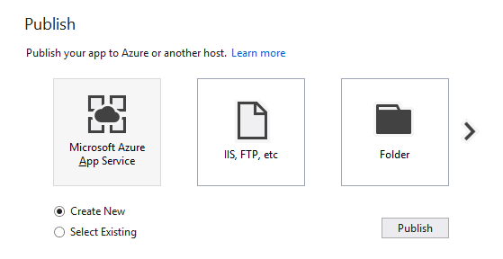
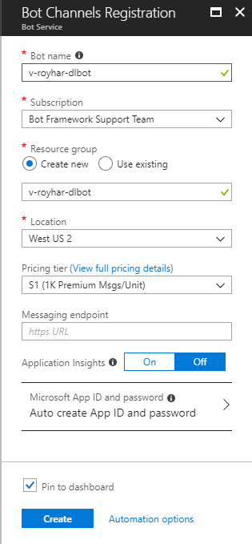
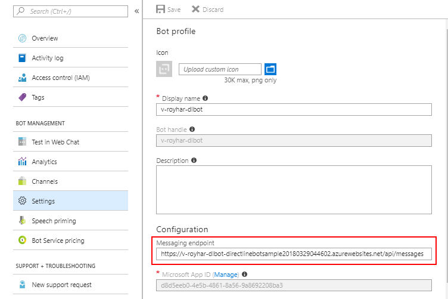
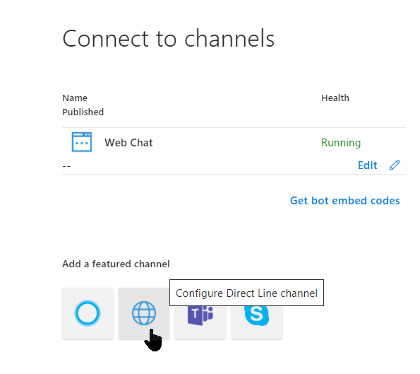

# How to create a Direct Line bot and client

[!INCLUDE [pre-release-label](../includes/pre-release-label.md)]

Microsoft Bot Framework Direct Line bots are bots that can function with a custom client of your own design. Direct Line bots are remarkably similar to normal bots. They just don't need to use the provided channels.

Direct Line clients can be written to be whatever you want them to be. You can write an Android client, an iOS client, or even a console-based client application.

In this topic you will learn how to create and deploy a Direct Line bot, and how to create and run a console-based Direct Line client app.

## Create your bot

Each language follows a different path to create the bot. Javascript creates the bot in Azure, then modifies the code while C# creates the bot locally, then publishes it to Azure, but both are valid methods and can be used with either language. If you want details on publishing your bot to Azure, take a look at [deploying your bot in Azure](../bot-builder-howto-deploy-azure.md).

# [C#](#tab/cscreatebot)

### Create the solution in Visual Studio

To create the solution for the Direct Line bot, in Visual Studio 2015 or later:

1. Create a new **ASP.NET Core Web Application**, in **Visual C#** > **.NET Core**.

1. For the name, enter **DirectLineBotSample**, and click **OK**.

1. Make sure **.NET Core** and **ASP.NET Core 2.0** are selected, choose the **Empty** project template, then click **OK**.

#### Add dependencies

1. In **Solution Explorer**, right click **Dependencies**, then choose **Manage NuGet Packages**.

1. Click **Browse**, then make sure the **Include prerelease** check box is checked.

1. Search for and install the following NuGet packages:
    - Microsoft.Bot.Builder
    - Microsoft.Bot.Builder.Core.Extensions
    - Microsoft.Bot.Builder.Integration.AspNet.Core
    - Newtonsoft.Json

### Create the appsettings.json file

The appsettings.json file will contain the Microsoft App ID, App Password, and Data Connection string. Since this bot will not store state information, the Data Connection string remain empty. And if you're only using the Bot Framework Emulator, all of them can remain empty.

To create an **appsettings.json** file:

1. Right-click the **DirectLineBotSample** Project, choose **Add** > **New Item**.

1. In **ASP.NET Core**, click **ASP.NET Configuration File**.

1. Type **appsettings.json** for the name, and click **Add**.

Replace the contents of the appsettings.json file with the following:

```json
{
    "Logging": {
        "IncludeScopes": false,
        "Debug": {
            "LogLevel": {
                "Default": "Warning"
            }
        },
        "Console": {
            "LogLevel": {
                "Default": "Warning"
            }
        }
    },

    "MicrosoftAppId": "",
    "MicrosoftAppPassword": "",
    "DataConnectionString": ""
}
```

### Edit Startup.cs

Replace the contents of the Startup.cs file with the following:

**Note**: **DirectBot** will be defined in the next step, so you can ignore the red underline on it.

```csharp
using System;
using System.Collections.Generic;
using System.Linq;
using System.Threading.Tasks;
using Microsoft.AspNetCore.Builder;
using Microsoft.AspNetCore.Hosting;
using Microsoft.AspNetCore.Http;
using Microsoft.Bot.Builder.BotFramework;
using Microsoft.Bot.Builder.Integration.AspNet.Core;
using Microsoft.Extensions.Configuration;
using Microsoft.Extensions.DependencyInjection;

namespace DirectLineBotSample
{
    public class Startup
    {
        public IConfiguration Configuration { get; }

        public Startup(IHostingEnvironment env)
        {
            var builder = new ConfigurationBuilder()
                .SetBasePath(env.ContentRootPath)
                .AddJsonFile("appsettings.json", optional: true, reloadOnChange: true)
                .AddJsonFile($"appsettings.{env.EnvironmentName}.json", optional: true)
                .AddEnvironmentVariables();
            Configuration = builder.Build();
        }

        // This method gets called by the runtime. Use this method to add services to the container.
        public void ConfigureServices(IServiceCollection services)
        {
            services.AddSingleton(_ => Configuration);
            services.AddBot<DirectBot>(options =>
            {
                options.CredentialProvider = new ConfigurationCredentialProvider(Configuration);
            });
        }

        // This method gets called by the runtime. Use this method to configure the HTTP request pipeline.
        public void Configure(IApplicationBuilder app, IHostingEnvironment env)
        {
            if (env.IsDevelopment())
            {
                app.UseDeveloperExceptionPage();
            }

            app.UseDefaultFiles();
            app.UseStaticFiles();
            app.UseBotFramework();
        }
    }
}
```

### Create the DirectBot class

The DirectBot class contains most of the logic for this bot.

1. Right-click the **DirectLineBotSample** > **Add** > **New Item**.

1. In **ASP.NET Core**, click **Class**.

1. Type **DirectBot.cs** for the name, and click **Add**.

Replace the contents of the DirectBot.cs file with the following:

```csharp
using System.Threading.Tasks;
using Microsoft.Bot;
using Microsoft.Bot.Builder;
using Microsoft.Bot.Builder.Core.Extensions;
using Microsoft.Bot.Schema;

namespace DirectLineBotSample
{
    public class DirectBot : IBot
    {
        public Task OnTurn(ITurnContext context)
        {
            // Respond to the various activity types.
            switch (context.Activity.Type)
            {
                case ActivityTypes.Message:
                    // Respond to the incoming text message.
                    RespondToMessage(context);
                    break;

                case ActivityTypes.ConversationUpdate:
                    break;

                case ActivityTypes.ContactRelationUpdate:
                    break;

                case ActivityTypes.Typing:
                    break;

                case ActivityTypes.Ping:
                    break;

                case ActivityTypes.DeleteUserData:
                    break;
            }

            return Task.CompletedTask;
        }

        /// <summary>
        /// Responds to the incoming message by either sending a hero card, an image, 
        /// or echoing the user's message.
        /// </summary>
        /// <param name="context">The context of this conversation.</param>
        private void RespondToMessage(ITurnContext context)
        {
            switch (context.Activity.Text.Trim().ToLower())
            {
                case "hi":
                case "hello":
                case "help":
                    // Send the user an instruction message.
                    context.SendActivity("Welcome to the Bot to showcase the DirectLine API. " +
                    "Send \"Show me a hero card\" or \"Send me a BotFramework image\" to see how the " +
                    "DirectLine client supports custom channel data. Any other message will be echoed.");
                    break;

                case "show me a hero card":
                    // Create the hero card.
                    HeroCard heroCard = new HeroCard()
                    {
                        Title = "Sample Hero Card",
                        Text = "Displayed in the DirectLine client"
                    };

                    // Attach the hero card to a new activity.
                    context.SendActivity(MessageFactory.Attachment(heroCard.ToAttachment()));
                    break;

                case "send me a botframework image":
                    // Create the image attachment.
                    Attachment imageAttachment = new Attachment()
                    {
                        ContentType = "image/png",
                        ContentUrl = "https://docs.microsoft.com/en-us/bot-framework/media/how-it-works/architecture-resize.png",
                    };

                    // Attach the image attachment to a new activity.
                    context.SendActivity(MessageFactory.Attachment(imageAttachment));
                    break;

                default:
                    // No command was encountered. Echo the user's message.
                    context.SendActivity($"You said \"{context.Activity.Text}\"");
                    break;
            }
        }
    }
}
```

**Note:** The exiting Program.cs file does not need to be changed.

To verify things are in order, press **F6** to build the project. There should be no warnings or errors.

### Publish the bot from Visual Studio

1. In Visual Studio, on the Solutions Explorer, right click on the **DirectLineBotSample** project and click **Set as StartUp Project**.

    

1. Right click **DirectLineBotSample** again and click **Publish**. The Visual Studio **Publish** page appears.

1. If you already have a publishing profile for this bot, select it and click the **Publish** button, then go on to the next section.

1. To create a new publishing profile, select the **Microsoft Azure App Service** icon.

1. Select **Create new**.

1. Click the **Publish** button. The **Create App Service** dialog appears.

    

    - For App Name, give it a name you can find later. For example, you can add your email name to the beginning of the App Name.

    - Verify you are using the correct subscription.

    - For Resource Group, verify you are using the correct resource group. The resource group can be found on the **Overview** blade of your bot. **Note:** An incorrect resource group is difficult to correct.

    - Verify you are using the correct App Service Plan.
    
1. Click the **Create** button. Visual Studio will begin deploying your bot.

After your bot is published, a browser will appear with the URL endpoint of your bot.

### Create Bot Channels Registration bot on Microsoft Azure

The Direct Line bot can be hosted on any platform. In this example, the bot will be hosted on Microsoft Azure. 

To create the bot on Microsoft Azure:

1. On the Microsoft Azure Portal, click **Create a resource**, then search for "Bot Channels Registration".

1. Click **Create**. The Bot Channels Registration blade appears.

    

1. On the Bot Channels Registration blade, enter the **Bot name**, **Subscription**, **Resource group**, **Location**, and **Pricing tier**.

1. Leave the **Messaging endpoint** blank. This value will be filled in later.

1. Click the **Microsoft App ID and password**, then click **Auto create App ID and password**.

1. Check the **Pin to dashboard** check box.

1. Click the **Create** button.

Deployment will take a few minutes, but once that's done it should appear in your dashboard.

### Update the appsettings.json file

1. Click the bot on your dashboard, or go to your new resource by clicking **All resources** and searching for the name of your Bot Channels Registration.

1. Click on **Overview**.

1. Copy the name of the Resource group into the **botId** string in the **Program.cs** of the **DirectLineClientSample** project.

1. Click **Settings**, then click **Manage** near the **Microsoft App ID** field.

1. Copy the Application ID and paste it into the **"MicrosoftAppId"** field of the **appsettings.json** file.

1. Click the **Generate New Password** button.

1. Copy the new password and paste it into the **"MicrosoftAppPassword"** field of the **appsettings.json** file.

### Set the Messaging endpoint

To add the endpoint to your bot:

1. Copy the URL address from the browser that popped up after publishing your bot.

    

1. Bring up the **Settings** blade of your bot.

1. Paste the address into the **Messaging endpoint**.

1. Edit the address to start with "https://" and end with "/api/messages". For example, if the address copied from the browser is "http://v-royhar-dlbot-directlinebotsample20180329044602.azurewebsites.net", edit it to "https://v-royhar-dlbot-directlinebotsample20180329044602.azurewebsites.net/api/messages".

1. Click the **Save** button on the Settings blade.

**NOTE:** If publishing fails, you may need to stop your bot on Azure before you can publish changes to your bot.

1. Find your App Service name (it's between the "https://" and ".azurewebsites.net".

1. Search for that resource in the Azure Portal "All resources".

1. Click on the App Service resource. The App Serivce blade appears.

1. Click the **Stop** button on the App Service blade.

1. In Visual Studio, Publish your bot again.

1. Click the **Start** button on the App Service blade.

### Test your bot in webchat

To verify that your bot is working, check your bot in webchat:

1. In the Bot Channels Registration blade for your bot, click **Settings**, then **Test in Web Chat**.

1. Type "Hi". The bot should respond with a welcome message.

1. Type "show me a hero card". The bot should display a hero card.

1. Type "send me a botframework image". The bot should display an image from the Bot Framework documentation.

1. Type anything else and the bot should reply with, "You said" and your message in quotes.

### Troubleshooting

If your bot is not working, verify or reenter your Microsoft App ID and password. Even if you copied it before, check the Microsoft App ID on the settings blade of your Bot Channels Registration against the value in the **"MicrosoftAppId"** field in the appsettings.json file.

Verify your password or create and use a new password: 

1. Click **Manage** next to the **Microsoft App ID** field on your Bot Channels Registration blade.

1. Log into the Application Registration Portal.

1. Verify the first three letters of your password match the **"MicrosoftAppPassword"** field in the **appsettings.json** file. 

1. If the values do not match, generate a new password and store that value in the **"MicrosoftAppPassword"** field in the **appsettings.json** file.

# [JavaScript](#tab/jscreatebot)

### Create Web App Bot on Microsoft Azure

To create the bot on Microsoft Azure: 

1. On the Microsoft Azure Portal, click **Create a resource**, then search for "Web App Bot".

1. Click **Create**. The Web App Bot blade appears.


1. On the Web App Bot blade, enter the **Bot name**, **Subscription**, **Resource group**, **Location**, **Pricing tier**, **App name**.

1. Select the bot template you would like to use. **SDK version: SDK v4** and **SDK language: Node.js** 

1. Select the basic v4 preview template. 

1. Choose your **App service plan/Location**, **Azure Storage** and **Application Insights Location**.

1. Check the Pin to dashboard check box.

1. Click the Create button.

1. Wait for your bot to be deployed. Because you checked the Pin to dashboard check box, your bot will appear on your dashboard.

### Edit your Direct Line Bot

Now lets add some more features to the echo bot.

1. On the Web App Bot blade, click Build. 

1. Click Download zip file. 

1. Extract the .zip file to a local directory.

1. Navigate to the extracted folder and open the source files in your favorite IDE.

1. In the app.js file copy and paste the code below.

```javascript
// Copyright (c) Microsoft Corporation. All rights reserved.
// Licensed under the MIT License.

const { BotFrameworkAdapter, MessageFactory, CardFactory } = require('botbuilder');
const restify = require('restify');

// Create server
let server = restify.createServer();
server.listen(process.env.port || process.env.PORT || 3978, function () {
    console.log(`${server.name} listening to ${server.url}`);
});

// Create adapter
const adapter = new BotFrameworkAdapter({
    appId: process.env.MicrosoftAppId,
    appPassword: process.env.MicrosoftAppPassword
});

// Responds to the incoming message by either sending a hero card, an image, 
// or echoing the user's message.

// Listen for incoming requests 
server.post('/api/messages', (req, res) => {
    // Route received request to adapter for processing
    adapter.processActivity(req, res, (context) => {
        if (context.activity.type === 'message') {
            const text = (context.activity.text || '').trim().toLowerCase()

            switch(text){
                case 'hi':
                case "hello":
                case "help":
                    // Send the user an instruction message.
                    return context.sendActivity("Welcome to the Bot to showcase the DirectLine API. " +
                    "Send \"Show me a hero card\" or \"Send me a BotFramework image\" to see how the " +
                    "DirectLine client supports custom channel data. Any other message will be echoed.");
                    break;

                case 'show me a hero card':
                    // Create the hero card.
                    const message = MessageFactory.attachment(
                        CardFactory.heroCard(   
                        'Sample Hero Card', //cards title
                        'Displayed in the DirectLine client' //cards text
                        )
                    );
                    return context.sendActivity(message);
                    break;
                    
                case 'send me a botframework image':
                    // Create the image attachment.
                    const imageOrVideoMessage = MessageFactory.contentUrl('https://docs.microsoft.com/en-us/azure/bot-service/media/how-it-works/architecture-resize.png', 'image/png')
                    return context.sendActivity(imageOrVideoMessage);
                    break;
                
                default:
                    // No command was encountered. Echo the user's message.
                    return context.sendActivity(`You said ${context.activity.text}`);
                    break;
                    
            }
        }
    });
});

```

When you are ready, you can publish the sources back to Azure. [Follow these steps to learn how to publish your bot back to Azure](../bot-service-build-download-source-code.md#publish-node-bot-source-code-to-azure)

---


## Create the console client app

# [C#](#tab/csclientapp)

The console client application operates in two threads. The primary thread accepts user input and sends messages to the bot. The secondary thread polls the bot once per second to retrieve any messages from the bot, then displays the messages received.

To create the console project:

1. Right-click the **Solution 'DirectLineBotSample'** in Solution Explorer.

1. Choose **Add** > **New Project**.

1. In **Visual C#** > **Windows Classic Desktop*, choose **Console App (.NET Framework)**.
 
    **Note:** Do not choose **Console App (.NET Core)**.

1. For the name, enter **DirectLineClientSample**.

1. Click **OK**.

### Add the NuGet packages to the console app

1. Right-click **References**.

1. Click **Manage NuGet Packages**.

1. Click **Browse**. Make sure the **Include prerelease** check box is checked.

1. Search for and install the following NuGet packages:
    - Microsoft.Bot.Connector.DirectLine (v3.0.2)
    - Newtonsoft.Json

### Edit the Program.cs file

Replace the contents of the DirectLineClientSample **Program.cs** file with the following:

```csharp
using System;
using System.Diagnostics;
using System.Linq;
using System.Threading.Tasks;
using Microsoft.Bot.Connector.DirectLine;
using Newtonsoft.Json;

namespace DirectLineClientSample
{
    class Program
    {
        // ************
        // Replace the following values with your Direct Line secret and the name of your bot resource ID.
        //*************
        private static string directLineSecret = "*** Replace with Direct Line secret ***";
        private static string botId = "*** Replace with the resource name of your bot ***";

        // This gives a name to the bot user.
        private static string fromUser = "DirectLineClientSampleUser";

        static void Main(string[] args)
        {
            StartBotConversation().Wait();
        }


        /// <summary>
        /// Drives the user's conversation with the bot.
        /// </summary>
        /// <returns></returns>
        private static async Task StartBotConversation()
        {
            // Create a new Direct Line client.
            DirectLineClient client = new DirectLineClient(directLineSecret);

            // Start the conversation.
            var conversation = await client.Conversations.StartConversationAsync();

            // Start the bot message reader in a separate thread.
            new System.Threading.Thread(async () => await ReadBotMessagesAsync(client, conversation.ConversationId)).Start();

            // Prompt the user to start talking to the bot.
            Console.Write("Type your message (or \"exit\" to end): ");

            // Loop until the user chooses to exit this loop.
            while (true)
            {
                // Accept the input from the user.
                string input = Console.ReadLine().Trim();

                // Check to see if the user wants to exit.
                if (input.ToLower() == "exit")
                {
                    // Exit the app if the user requests it.
                    break;
                }
                else
                {
                    if (input.Length > 0)
                    {
                        // Create a message activity with the text the user entered.
                        Activity userMessage = new Activity
                        {
                            From = new ChannelAccount(fromUser),
                            Text = input,
                            Type = ActivityTypes.Message
                        };

                        // Send the message activity to the bot.
                        await client.Conversations.PostActivityAsync(conversation.ConversationId, userMessage);
                    }
                }
            }
        }


        /// <summary>
        /// Polls the bot continuously and retrieves messages sent by the bot to the client.
        /// </summary>
        /// <param name="client">The Direct Line client.</param>
        /// <param name="conversationId">The conversation ID.</param>
        /// <returns></returns>
        private static async Task ReadBotMessagesAsync(DirectLineClient client, string conversationId)
        {
            string watermark = null;

            // Poll the bot for replies once per second.
            while (true)
            {
                // Retrieve the activity set from the bot.
                var activitySet = await client.Conversations.GetActivitiesAsync(conversationId, watermark);
                watermark = activitySet?.Watermark;

                // Extract the activies sent from our bot.
                var activities = from x in activitySet.Activities
                                 where x.From.Id == botId
                                 select x;

                // Analyze each activity in the activity set.
                foreach (Activity activity in activities)
                {
                    // Display the text of the activity.
                    Console.WriteLine(activity.Text);

                    // Are there any attachments?
                    if (activity.Attachments != null)
                    {
                        // Extract each attachment from the activity.
                        foreach (Attachment attachment in activity.Attachments)
                        {
                            switch (attachment.ContentType)
                            {
                                // Display a hero card.
                                case "application/vnd.microsoft.card.hero":
                                    RenderHeroCard(attachment);
                                    break;

                                // Display the image in a browser.
                                case "image/png":
                                    Console.WriteLine($"Opening the requested image '{attachment.ContentUrl}'");
                                    Process.Start(attachment.ContentUrl);
                                    break;
                            }
                        }
                    }

                    // Redisplay the user prompt.
                    Console.Write("\nType your message (\"exit\" to end): ");
                }

                // Wait for one second before polling the bot again.
                await Task.Delay(TimeSpan.FromSeconds(1)).ConfigureAwait(false);
            }
        }


        /// <summary>
        /// Displays the hero card on the console.
        /// </summary>
        /// <param name="attachment">The attachment that contains the hero card.</param>
        private static void RenderHeroCard(Attachment attachment)
        {
            const int Width = 70;
            // Function to center a string between asterisks.
            Func<string, string> contentLine = (content) => string.Format($"{{0, -{Width}}}", string.Format("{0," + ((Width + content.Length) / 2).ToString() + "}", content));

            // Extract the hero card data.
            var heroCard = JsonConvert.DeserializeObject<HeroCard>(attachment.Content.ToString());

            // Display the hero card.
            if (heroCard != null)
            {
                Console.WriteLine("/{0}", new string('*', Width + 1));
                Console.WriteLine("*{0}*", contentLine(heroCard.Title));
                Console.WriteLine("*{0}*", new string(' ', Width));
                Console.WriteLine("*{0}*", contentLine(heroCard.Text));
                Console.WriteLine("{0}/", new string('*', Width + 1));
            }
        }
    }
}
```

To verify things are in order, press **F6** to build the project. There should be no warnings or errors.

# [JavaScript](#tab/jsclientapp)

### Create a Direct Line Client 

Now that you have deployed your web app bot we can create a Direct Line Client.

```
    md DirectLineClient
    cd DirectLineClient
    npm init
```

Next, install these packages from npm

```
    npm install --save open
    npm install --save request
    npm install --save request-promise
    npm install --save swagger-client
```

Create an **app.js** file. Copy and paste the code below into this file.

We will get the directLineSecret in the next step.
```javascript
var Swagger = require('swagger-client');
var open = require('open');
var rp = require('request-promise');

// config items
var pollInterval = 1000;
// Change the Direct Line Secret to your own 
var directLineSecret = 'your secret here';
var directLineClientName = 'DirectLineClient';
var directLineSpecUrl = 'https://docs.botframework.com/en-us/restapi/directline3/swagger.json';

var directLineClient = rp(directLineSpecUrl)
    .then(function (spec) {
        // client
        return new Swagger({
            spec: JSON.parse(spec.trim()),
            usePromise: true
        });
    })
    .then(function (client) {
        // add authorization header to client
        client.clientAuthorizations.add('AuthorizationBotConnector', new Swagger.ApiKeyAuthorization('Authorization', 'Bearer ' + directLineSecret, 'header'));
        return client;
    })
    .catch(function (err) {
        console.error('Error initializing DirectLine client', err);
    });

// once the client is ready, create a new conversation
directLineClient.then(function (client) {
    client.Conversations.Conversations_StartConversation()                          // create conversation
        .then(function (response) {
            return response.obj.conversationId;
        })                            // obtain id
        .then(function (conversationId) {
            sendMessagesFromConsole(client, conversationId);                        // start watching console input for sending new messages to bot
            pollMessages(client, conversationId);                                   // start polling messages from bot
        })
        .catch(function (err) {
            console.error('Error starting conversation', err);
        });
});

// Read from console (stdin) and send input to conversation using DirectLine client
function sendMessagesFromConsole(client, conversationId) {
    var stdin = process.openStdin();
    process.stdout.write('Command> ');
    stdin.addListener('data', function (e) {
        var input = e.toString().trim();
        if (input) {
            // exit
            if (input.toLowerCase() === 'exit') {
                return process.exit();
            }

            // send message
            client.Conversations.Conversations_PostActivity(
                {
                    conversationId: conversationId,
                    activity: {
                        textFormat: 'plain',
                        text: input,
                        type: 'message',
                        from: {
                            id: directLineClientName,
                            name: directLineClientName
                        }
                    }
                }).catch(function (err) {
                    console.error('Error sending message:', err);
                });

            process.stdout.write('Command> ');
        }
    });
}

// Poll Messages from conversation using DirectLine client
function pollMessages(client, conversationId) {
    console.log('Starting polling message for conversationId: ' + conversationId);
    var watermark = null;
    setInterval(function () {
        client.Conversations.Conversations_GetActivities({ conversationId: conversationId, watermark: watermark })
            .then(function (response) {
                watermark = response.obj.watermark;                                 // use watermark so subsequent requests skip old messages
                return response.obj.activities;
            })
            .then(printMessages);
    }, pollInterval);
}

// Helpers methods
function printMessages(activities) {
    if (activities && activities.length) {
        // ignore own messages
        activities = activities.filter(function (m) { return m.from.id !== directLineClientName });

        if (activities.length) {
            process.stdout.clearLine();
            process.stdout.cursorTo(0);

            // print other messages
            activities.forEach(printMessage);

            process.stdout.write('Command> ');
        }
    }
}

function printMessage(activity) {
    if (activity.text) {
        console.log(activity.text);
    }

    if (activity.attachments) {
        activity.attachments.forEach(function (attachment) {
            switch (attachment.contentType) {
                case "application/vnd.microsoft.card.hero":
                    renderHeroCard(attachment);
                    break;

                case "image/png":
                    console.log('Opening the requested image ' + attachment.contentUrl);
                    open(attachment.contentUrl);
                    break;
            }
        });
    }
}

function renderHeroCard(attachment) {
    var width = 70;
    var contentLine = function (content) {
        return ' '.repeat((width - content.length) / 2) +
            content +
            ' '.repeat((width - content.length) / 2);
    }

    console.log('/' + '*'.repeat(width + 1));
    console.log('*' + contentLine(attachment.content.title) + '*');
    console.log('*' + ' '.repeat(width) + '*');
    console.log('*' + contentLine(attachment.content.text) + '*');
    console.log('*'.repeat(width + 1) + '/');
}
```

---

## Configure the Direct Line channel

Adding the Direct Line channel makes this bot into a Direct Line bot.

To configure the Direct Line channel:



1. On the **Bot Channels Registration** blade, click **Channels**. The **Connect to Channels** blade will appear.

    

1. On the **Connect to Channels** blade, click the **Configure Direct Line channel** button. 

1. If **3.0** is not checked, put a check mark in the check box.

1. Click **Show** for at least one secret key.

1. Copy one of the secret keys and paste it into your client app, into the **directLineSecret** string.

1. Click Done.

## Run the client app

# [C#](#tab/csrunclient)

Your bot is now ready to communicate with the Direct Line console client application. To run the console app, do the following:

1. In Visual Studio, right click **DirectLineClientSample** project and select **Set as StartUp Project**.

1. Examine the **Program.cs** file in the **DirectLineClientSample** project.

    - Verify that the one Direct Line secret code is in the **directLineSecret** string.

1. If the **directLineSecret** isn't correct, go to the Azure portal, click your Direct Line bot, click **Channels**, click **Configure Direct Line channel** (or **Edit**), show a key, then copy that key to the **directLineSecret** string.

    - Verify that the resource group is in the **botId** string.

1. If it isn't, from the **Overview** blade, copy-and-paste the **Resource group** into the **botId** string.

1. Press F5 or Start debugging.

The console client app will start. To test out the app: 

1. Enter "Hi". The bot should display 'You said "Hi"'.

1. Enter "show me a hero card". The bot should display a hero card.

1. Enter "send me a botframework image". The bot will launch a browser to display an image from the Bot Framework documentation.

1. Enter anything else and the bot should reply with, "You said" and your message in quotes.

# [JavaScript](#tab/jsrunclient)

To run the sample you will need to run your DirectLineClient app.

1. Open a CMD console and CD to the DirectLineClient directory

1. Run `node app.js`

To test the custom messages type in the Client's console show me a hero card or send me a botframework image and you should see the following outcome.


---


### Next steps
