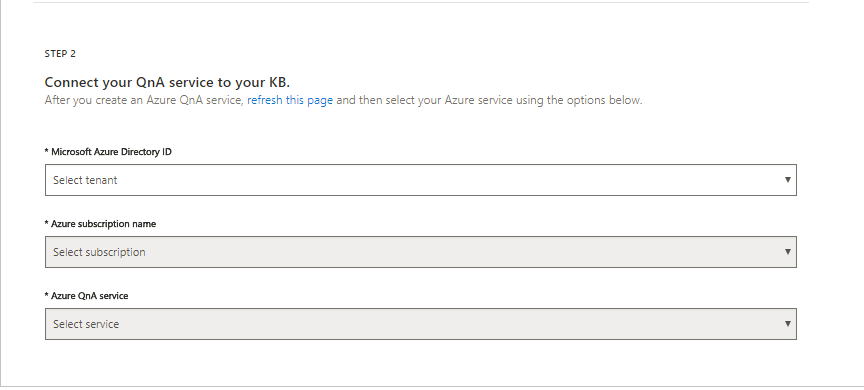
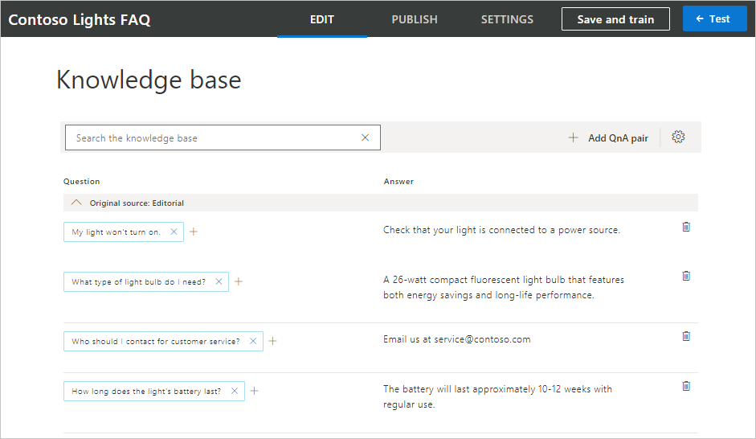

# How to use QnA Maker

Microsoft provides a couple of rich services which you can use to make your bot richer.
You can easily add rich Language Understanding to your bot using the [LUIS](https://www.luis.ai/home), detailed in it's own topic on [how to use LUIS](bot-builder-howto-v4-LUIS.md) service or add simple question and answer support to your bot using the [QnA Maker](https://qnamaker.ai/) service.

## QnA Maker Starting Off

One of the basic requirements in writing your own Bot service is to seed it with questions and answers. In many cases, the questions and answers already exist in content like FAQs, URLs/documentation, etc. Other times you would like to customize your answers to questions in a more natural, conversational way. 

Here we will create a simple QnA example that gives you all the necessary steps to create one of your own. Click the link to get started. [QnA Maker](https://qnamaker.ai/)

First create an account or sign in then navigate to Create new service. Here you can fill out the Service Name, the URL that contains the FAQ file, Upload a File or manually enter questions and answers. Click create to continue.
 


Here you will be able to add new QnA pairs. Enter your own question and answers or copy the sample below. 


After adding new QnA pairs, click **Save and train**. Once you are completed, in the **PUBLISH** tab, click **Publish**.

To connect your QnA service to your bot, you will need the HTTP request string containing the knowledge base ID and QnA Maker subscription key. Copy the example HTTP request from the publishing result. 



## Installing Packages

Before we get coding, make sure you have the packages necessary for QnA Maker.

# [C#](#tab/csref)

[Add a reference](https://docs.microsoft.com/en-us/nuget/tools/package-manager-ui) to v4 prerelease version of the following NuGet packages:

* `Microsoft.Bot.Builder.Ai.QnA`

# [JavaScript](#tab/jsref)

Either of these services can be added to your bot using the botbuilder-ai package. You can add this package to your project via npm:

* `npm install --save botbuilder@preview`
* `npm install --save botbuilder-ai@preview`

---


## Using QnA Maker

QnA Maker is first added as middleware, then we can use the results within our bot logic.

# [C#](#tab/csqna)

Update the `ConfigureServices` method in your `Startup.cs` file to add a `QnAMakerMiddleware` object. You can configure your bot to check your knowledge base for every message received from a user, by simply adding it to your bot's middleware stack.

<!--  TODO: Should we still document this?
Setting the `EndActivityRoutingOnAnswer` option to true will short circuit the middleware pipeline if an answer is found in the knowledge base and sent to the user.
```
        var qnaOptions = new QnAMakerMiddlewareOptions
                {
                    EndActivityRoutingOnAnswer = true
                };
```
-->
```csharp
using Microsoft.AspNetCore.Builder;
using Microsoft.AspNetCore.Hosting;
using Microsoft.Bot.Builder.Ai.Qna;
using Microsoft.Bot.Builder.BotFramework;
using Microsoft.Bot.Builder.Core.Extensions;
using Microsoft.Bot.Builder.Integration.AspNet.Core;
using Microsoft.Extensions.Configuration;
using Microsoft.Extensions.DependencyInjection;
using Microsoft.Extensions.Logging;
using System;

public void ConfigureServices(IServiceCollection services)
{
    services.AddSingleton(_ => Configuration);
    services.AddBot<AiBot>(options =>
    {
        options.CredentialProvider = new ConfigurationCredentialProvider(Configuration);

        var endpoint = new QnAMakerEndpoint
            {
                knowledgebaseId = "YOUR-KB-ID",
                // Get the Host from the HTTP request example at https://www.qnamaker.ai
                // For GA services: https://<Service-Name>.azurewebsites.net/qnamaker
                // For Preview services: https://westus.api.cognitive.microsoft.com/qnamaker/v2.0
                Host = "YOUR-HTTP-REQUEST-HOST",
                EndpointKey = "YOUR-QNA-MAKER-SUBSCRIPTION-KEY"
            };
        options.Middleware.Add(new QnAMakerMiddleware(new QnAMakerEndpoint(endpoint)));
    });
}
```


Edit code in the EchoBot.cs file, so that `OnTurn` sends a fallback message in the case that the QnA Maker middleware didn't send a response to the user's question:

```csharp
using System.Threading.Tasks;
using Microsoft.Bot;
using Microsoft.Bot.Builder;
using Microsoft.Bot.Schema;

namespace Bot_Builder_Echo_Bot_QnA
{
    public class EchoBot : IBot
    {    
        public async Task OnTurn(ITurnContext context)
        {
            // This bot is only handling Messages
            if (context.Activity.Type == ActivityTypes.Message)
            {             
                if (!context.Responded)
                {
                    // QnA didn't send the user an answer
                    await context.SendActivity("Sorry, I couldn't find a good match in the KB.");

                }
            }
        }
    }
}
```


A [full sample of QnA Maker](https://github.com/Microsoft/botbuilder-dotnet/tree/master/samples/Microsoft.Bot.Samples.Ai.QnA) and it's source code can be found in the sample folder of our repo.

# [JavaScript](#tab/jsluis)

First require/import in the [QnAMaker](https://github.com/Microsoft/botbuilder-js/tree/master/doc/botbuilder-ai/classes/botbuilder_ai.qnamaker.md) class:

```js
const { QnAMaker } = require('botbuilder-ai');
```

Create a `QnAMaker` by initializing it with a string based on the HTTP request for your QnA service. You can copy an example request for your service from the [QnA Maker portal](https://qnamaker.ai) under Settings > Deployment details.

The format of the string varies depending on whether your QnA Maker service is using the GA or the Preview version of QnA Maker.

**Preview**
```js
const qnaEndpointString = 
    // Replace xxxxxxxx-xxxx-xxxx-xxxx-xxxxxxxxxxxx with your knowledge base ID
    "POST /knowledgebases/xxxxxxxx-xxxx-xxxx-xxxx-xxxxxxxxxxxx/generateAnswer\r\n" + 
    "Host: https://westus.api.cognitive.microsoft.com/qnamaker/v2.0\r\n" +
    // Replace xxxxxxxxxxxxxxxxxxxxxxxxxxxxxxxx with your QnAMaker subscription key
    "Ocp-Apim-Subscription-Key: xxxxxxxxxxxxxxxxxxxxxxxxxxxxxxxx\r\n"
const qna = new QnAMaker(qnaEndpointString);
```

**GA**
```js
const qnaEndpointString = 
    // Replace xxxxxxxx-xxxx-xxxx-xxxx-xxxxxxxxxxxx with your knowledge base ID
    "POST /knowledgebases/xxxxxxxx-xxxx-xxxx-xxxx-xxxxxxxxxxxx/generateAnswer\r\n" + 
    // Replace <Service-Name> to match the Azure URL where your service is hosted
    "Host: https://<Service-Name>.azurewebsites.net/qnamaker\r\n" +
    // Replace xxxxxxxxxxxxxxxxxxxxxxxxxxxxxxxx with your QnAMaker subscription key
    "Authorization: EndpointKey xxxxxxxxxxxxxxxxxxxxxxxxxxxxxxxx\r\n"
const qna = new QnAMaker(qnaEndpointString);
```
You can configure your bot to automatically call QNA maker as your bot's fallback request processing logic by simply adding it to your bot's middleware stack:

```js
adapter.use(qna);
```

This will only call QnA Maker after all of your bot's main logic runs and only if nothing else in your bot has replied to the user. For even more control over how and when QnA Maker is called, you can call `qna.answer()` directly from within your bot's logic instead of installing it as a piece of middleware:

```js
// Listen for incoming activity 
server.post('/api/messages', (req, res) => {
    // Route received activity to adapter for processing
    adapter.processActivity(req, res, async (context) => {
        if (context.activity.type === 'message') {
            var handled = await qna.answer(context)
                if (!handled) {
                    await context.sendActivity(`I'm sorry. I didn't understand.`);
                }
        }
    });
});
```
Another way to customize the QnA Maker is with `qna.generateAnswer()`. This method allows you to choose how to respond with an answer as well as what to do when there is no suitable answer to the question.


```js
// Listen for incoming activity 
server.post('/api/messages', (req, res) => {
    // Route received activity to adapter for processing
    adapter.processActivity(req, res, async (context) => {
        if (context.activity.type === 'message') {
            // FOR MORE CUSTOMIZATION
            var results = await qna.generateAnswer(context.activity.text);
                if (results && results.length > 0) {
                    await context.sendActivity(results[0].answer);
                } else {
                    await context.sendActivity(`I don't know.`);
                }
    
        }
    });
});
```
---

You can now ask your bot questions and it will reply with your answers.



## Next steps

QnA Maker can be combined with other Cognitive Services, to make your bot even more powerful. For an example of this, check out [Combining LUIS and QnA Maker](bot-builder-combine-luis-and-qna.md).
