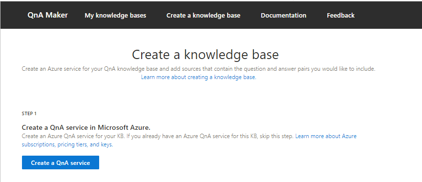

# How to use QnA Maker

Microsoft provides a couple of rich services which you can use to make your bot richer.
You can easily add rich Language Understanding to your bot using the [LUIS](https://www.luis.ai/home), detailed in it's own topic on [how to use LUIS](bot-builder-how-to-v4-LUIS.md) service or add simple question and answer support to your bot using the [QnA Maker](https://qnamaker.ai/) service.

## QnA Maker Starting Off

One of the basic requirements in writing your own Bot service is to seed it with questions and answers. In many cases, the questions and answers already exist in content like FAQs, URLs/documentation, etc. Other times you would like to customize your answers to questions in a more natural, conversational way. 

Here we will create a simple QnA example that gives you all the necessary steps to create one of your own. Click the link to get started. [QnA Maker](https://qnamaker.ai/)

First create an account or sign in then navigate to Create new service. Here you can fill out the Service Name, the URL that contains the FAQ file, Upload a File or manually enter questions and answers. Click create to continue.
 


Here you will be able to add new QnA pairs. Enter your own question and answers or copy the sample below. 


After adding new QnA pairs, click *Save and retrain*. Once you are completed, click *Publish*.

To connect your QnA service to your bot, you will need a `knowledgeBaseId` and `subscriptionKey`. Both are found here. 


## Installing Packages

Before we get coding, make sure you have the packages necessary for QnA Maker.

# [C#](#tab/csref)

[Add a reference](https://docs.microsoft.com/en-us/nuget/tools/package-manager-ui) to v4 prerelease version of the following NuGet packages:

* `Microsoft.Bot.Builder.Integration.AspNet.Core`
* `Microsoft.Bot.Builder.Ai`

# [JavaScript](#tab/jsref)

Either of these services can be added to your bot using the botbuilder-ai package. You can add this package to your project via npm:

* `npm install --save botbuilder@preview`
* `npm install --save botbuilder-ai@preview`

---


## Using QnA Maker

QnA Maker is first added as middleware, then we can use the results within our bot logic.

# [C#](#tab/csqna)

Update the `ConfigureServices` method in your `Startup.cs` file to add a `QnAMakerMiddleware` object. You can configure your bot to check your knowledge base for every message received from a user, by simply adding it to your bot's middleware stack.


```csharp
using Microsoft.AspNetCore.Builder;
using Microsoft.AspNetCore.Hosting;
using Microsoft.Bot.Builder.Ai;
using Microsoft.Bot.Builder.BotFramework;
using Microsoft.Bot.Builder.Core.Extensions;
using Microsoft.Bot.Builder.Integration.AspNet.Core;
using Microsoft.Extensions.Configuration;
using Microsoft.Extensions.DependencyInjection;
using Microsoft.Extensions.Logging;
using System;

public void ConfigureServices(IServiceCollection services)
{
    services.AddSingleton(_ => Configuration);
    services.AddBot<AiBot>(options =>
    {
        options.CredentialProvider = new ConfigurationCredentialProvider(Configuration);

        var qnaOptions = new QnAMakerMiddlewareOptions
                {
                    // add subscription key and knowledge base id
                    SubscriptionKey = "subscriptionKey",
                    KnowledgeBaseId = "knowledgebaseId",
                    EndActivityRoutingOnAnswer = true
                };

        options.Middleware.Add(new QnAMakerMiddleware(qnaOptions));
            
    });
}
```

Setting the `EndActivityRoutingOnAnswer` option to true will short circuit the middleware pipeline if an answer is found in the knowledge base and sent to the user.

Replace the code in the AiBot.cs file with the following:

```csharp
using Microsoft.Bot.Builder;
using Microsoft.Bot.Schema;
using System.Threading.Tasks;

namespace Microsoft.Bot.Samples
{
    public class AiBot : IBot
    {
        public async Task OnReceiveActivity(IBotContext context)
        {
            if (context.Request.Type == ActivityTypes.Message)
            {
                // add app logic when QnA Maker doesn't find an answer
                await context.SendActivity("No good match found in the KB.");
            }
        }
    }
}
```
If no response is found, an appropriate message is displayed to the user. 

A [full sample of QnA Maker](https://github.com/Microsoft/botbuilder-dotnet/tree/master/samples/Microsoft.Bot.Samples.Ai.QnA) and it's source code can be found in the sample folder of our repo.

# [JavaScript](#tab/jsluis)

First require/import in the [QnAMaker](https://github.com/Microsoft/botbuilder-js/tree/master/doc/botbuilder-ai/classes/botbuilder_ai.qnamaker.md) class and create an instance bound to your knowledge base:

```js
const { QnAMaker } = require('botbuilder-ai');

const qna = new QnAMaker({
    knowledgeBaseId: '<knowledge bases id>',
    subscriptionKey: '<your subscription>',
    top: 1
});
```

You can configure your bot to automatically call QNA maker as your bots fallback request processing logic by simply adding it to your bots middleware stack:

```js
adapter.use(qna);
```

This will only call QnA Maker after all of your bots main logic runs and only if nothing else in your bot has replied to the user. For even more control over how and when QnA Maker is called, you can call `qna.answer()` directly from within your bots logic instead of installing it as a piece of middleware:

```js
// Listen for incoming activity 
server.post('/api/messages', (req, res) => {
    // Route received activity to adapter for processing
    adapter.processActivity(req, res, async (context) => {
        if (context.activity.type === 'message') {
            var handled = await qna.answer(context)
                if (!handled) {
                    await context.sendActivity(`I'm sorry. I didn't understand.`);
                }
        }
    });
});
```
Another way to customize the QnA Maker is with `qna.generateAnswer()`. This method allows you to choose how to respond with an answer as well as what to do when there is no suitable answer to the question.


```js
// Listen for incoming activity 
server.post('/api/messages', (req, res) => {
    // Route received activity to adapter for processing
    adapter.processActivity(req, res, async (context) => {
        if (context.activity.type === 'message') {
            // FOR MORE CUSTOMIZATION
            var results = await qna.generateAnswer(context.activity.text);
                if (results && results.length > 0) {
                    await context.sendActivity(results[0].answer);
                } else {
                    await context.sendActivity(`I don't know.`);
                }
    
        }
    });
});
```
---

You can now ask your bot questions and it will reply with your answers.


## Next steps

QnA Maker can be combined with other Cognitive Services, to make your bot even more powerful. For an example of this, check out [Combining LUIS and QnA Maker](bot-builder-combine-luis-and-qna.md).
