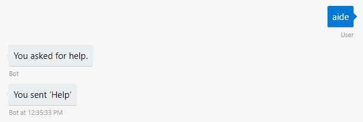
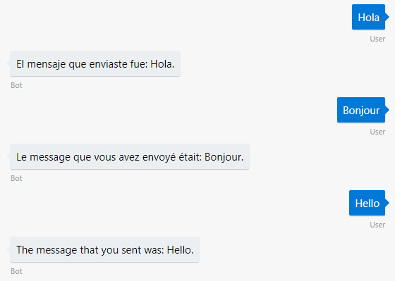
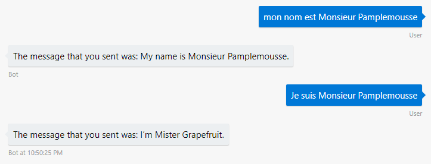

# Translate user input to make your bot multilingual

[!INCLUDE [pre-release-label](../includes/pre-release-label.md)]

Your bot can use [Microsoft Translator](https://www.microsoft.com/en-us/translator/) to automatically translate messages to the language your bot understands, and optionally translate the bot's replies back to the user's language. Adding translation to your bot allows it to reach a larger audience without changing significant parts of your bot's core programming.
<!-- 
- [Get a Text Services key](#get-a-text-services-key)
- [Installing Packages](#installing-packages)
- [Combine translation with LUIS or QnA Maker](#using-luis)
- [Combine translation with QnA Maker](#using-qna-maker)
-->

In this tutorial we'll be using Microsoft Translator service for the translation, then adding it to a simple bot to show how it works.

## Get a Text Services key

First, you'll need a key for using the Microsoft Translator service. You can get a [free trial key](https://www.microsoft.com/en-us/translator/trial.aspx#get-started) in the Azure portal.

## Installing Packages

Make sure you have the packages necessary to add translation to your bot.

# [C#](#tab/cs)

[Add a reference](https://docs.microsoft.com/en-us/nuget/tools/package-manager-ui) to the prerelease version of the following NuGet packages:

* `Microsoft.Bot.Builder.Integration.AspNet.Core`
* `Microsoft.Bot.Builder.Ai.Translation` (required for translation)

If you're going to combine translation with Language Understanding (LUIS), also add a reference to:

* `Microsoft.Bot.Builder.Ai.Luis` (required for LUIS)

# [JavaScript](#tab/js)

Either of these services can be added to your bot using the botbuilder-ai package. You can add this package to your project via npm:
* `npm install --save botbuilder@preview`
* `npm install --save botbuilder-ai@preview`

---

## Configure translation

Next you can configure your bot to call the translator for every message received from a user, simply by adding it to your bot's middleware stack. The middleware uses the translation result to modify the user's message using the context object.


# [C#](#tab/cs)

Start with the EchoBot sample in the v4 SDK, and update the `ConfigureServices` method in your `Startup.cs` file to add `TranslationMiddleware` to the bot. This configures your bot to translate every message received from a user. <!--, by simply adding it to your bot's middleware set. The middleware stores the translation results on the context object. -->
-   Update your using statements.
-   Update your `ConfigureServices` method to include the translation middleware.

    The snippet here has been simplified by removing most of the comments and removing the exception handling middleware.

**Startup.cs**
```csharp
using System;
using System.Collections.Generic;
using Microsoft.AspNetCore.Builder;
using Microsoft.AspNetCore.Hosting;
using Microsoft.Bot.Builder.Ai.Translation;
using Microsoft.Bot.Builder.BotFramework;
using Microsoft.Bot.Builder.Core.Extensions;
using Microsoft.Bot.Builder.Integration.AspNet.Core;
using Microsoft.Extensions.Configuration;
using Microsoft.Extensions.DependencyInjection;
using Microsoft.Extensions.Logging;
```
```csharp
// This method gets called by the runtime. Use this method to add services to the container.
public void ConfigureServices(IServiceCollection services)
{
    services.AddBot<EchoBot>(options =>
    {
        options.CredentialProvider = new ConfigurationCredentialProvider(Configuration);
        var middleware = options.Middleware;
        // Add translation middleware
        // The first parameter is a list of languages the bot recognizes
        middleware.Add(new TranslationMiddleware(new string[] { "en" }, "<YOUR MICROSOFT TRANSLATOR API KEY>", false));

    });
}


```

> [!TIP] 
> The BotBuilder SDK automatically detects the user's language based on the message they just submitted. 
> To override this functionality, you can supply additional callback parameters to add your own logic for detecting and changing the user's language.  


Take a look at the code in `EchoBot.cs`, where it sends "You sent" followed by what the user says:

```cs
using Microsoft.Bot.Builder;
using Microsoft.Bot.Schema;
using System.Threading.Tasks;

namespace Microsoft.Bot.Samples
{
    public class EchoBot : IBot
    {
        public EchoBot() { }

        public async Task OnTurn(ITurnContext context)
        {
            switch (context.Activity.Type)
            {
                case ActivityTypes.Message:
                // echo back the user's input.
                    await context.SendActivity($"You sent '{context.Activity.Text}'");


                case ActivityTypes.ConversationUpdate:
                    foreach (var newMember in context.Activity.MembersAdded)
                    {
                        if (newMember.Id != context.Activity.Recipient.Id)
                        {
                            await context.SendActivity("Hello and welcome to the echo bot.");
                        }
                    }
                    break;
            }
        }
        
    }
}
```

When you add translation middleware, an optional parameter specifies whether to translate replies back to the user's language. In `Startup.cs`, we specified `false` to just translate the user messages to the bot's language.

```cs
// The first parameter is a list of languages the bot recognizes
// The second parameter is your API key
// The third parameter specifies whether to translate the bot's replies back to the user's language
middleware.Add(new TranslationMiddleware(new string[] { "en" }, "<YOUR MICROSOFT TRANSLATOR API KEY>", false));
```

# [JavaScript](#tab/js)

To set up translation middleware with an echo bot, paste the following into app.js.

```javascript
const { BotFrameworkAdapter, MemoryStorage, ConversationState } = require('botbuilder');
const { LanguageTranslator, LocaleConverter } = require('botbuilder-ai');
const restify = require('restify');

// Create server
let server = restify.createServer();
server.listen(process.env.port || process.env.PORT || 3978, function () {
    console.log(`${server.name} listening to ${server.url}`);
});

// Create adapter
const adapter = new BotFrameworkAdapter({ 
    appId: process.env.MICROSOFT_APP_ID, 
    appPassword: process.env.MICROSOFT_APP_PASSWORD 
});

// Add language translator middleware
const languageTranslator = new LanguageTranslator({
    translatorKey: "xxxxxx",
    noTranslatePatterns: new Set(),
    nativeLanguages: ['en'] 
});
adapter.use(languageTranslator);


// Listen for incoming requests 
server.post('/api/messages', (req, res) => {
    // Route received request to adapter for processing
    adapter.processActivity(req, res, async (context) => {
        if (context.activity.type === 'message') {
            await context.sendActivity(`You said "${context.activity.text}"`);
        } else {
            await context.sendActivity(`[${context.activity.type} event detected]`);
        }
    });
});
```

---

## Run the bot and see translated input

Run the bot, and type in a few messages in other languages. You'll see that the bot translated the user message and indicates the translation in its response.


## Invoke logic in the bot's native language

Now, add logic that checks for English words. If the user says "help" or "cancel" in another language, the bot translates it into English and the logic that checks for the english words "help" or "cancel" is invoked.

# [C#](#tab/cs)
In `EchoBot.cs`, update the `case` statement for message activities in your bot's `OnTurn` method.
```cs
case ActivityTypes.Message:
    // check the message text before calling context.SendActivity
    var messagetext = context.Activity.Text.Trim().ToLower();
    if (string.Equals("help", messagetext))
    {
        await context.SendActivity("You asked for help.");
    }
```

# [JavaScript](#tab/js)
```javascript
if (context.activity.type === 'message') {
    // check the message text before calling context.sendActivity
    var messagetext = context.activity.text.trim().toLowerCase();
    if(messagetext === "help"){
        await context.sendActivity("you said help");
    }
}
```

---




## Translate replies back to the user's language

You can also translate replies back to the user's language, by setting the last constructor parameter to `true`.

# [C#](#tab/cs)
In `Startup.cs`, update the following line of the `ConfigureServices` method.
```cs
// Use language recognition to detect the user's language from their message, instead of providing helper callbacks.
// Last parameter indicates that we'll translate replies back to the user's language
middleware.Add(new TranslationMiddleware(new string[] { "en" }, "TRANSLATION-SUBSCRIPTION-KEY", true));
```

# [JavaScript](#tab/js)
```javascript
// Use language recognition to detect the user's language from their message, instead of providing helper callbacks.
// Last parameter indicates that we'll translate replies back to the user's language
const languageTranslator = new LanguageTranslator({
    translatorKey: "xxxxxx",
    noTranslatePatterns: new Set(),
    nativeLanguages: ['en'],
    translateBackToUserLanguage: true
});
adapter.use(languageTranslator);
```

---

## Run the bot to see replies in the user's language

Run the bot, and type in a few messages in other languages. You'll see that it detects the user's language and translates the response.




## Adding logic for detecting or changing the user language

Instead of letting the Botbuilder SDK automatically detect the user's language, you can provide callbacks to add your own logic for determining the user's language, or determining when the user's language has changed.

> [!TIP] 
> See the Translation sample in the SDK for a sample bot that implements callbacks for detecting and changing the user language. 

In the following example, the `CheckUserChangedLanguage` callback checks for a specific user message to change the language. 

# [C#](#tab/cs)
In `Startup.cs`, add a callback to the translation middleware.
```csharp
middleware.Add(new TranslationMiddleware(new string[] { "en" },
     "<YOUR MICROSOFT TRANSLATOR API KEY>", null,
     TranslatorLocaleHelper.GetActiveLanguage,
     TranslatorLocaleHelper.CheckUserChangedLanguage));
```
Add a `TranslatorLocalHelper.cs` file and add the following to the TranslatorLocalHelper class definition.
```csharp
    class CurrentUserState
    {
        public string Language { get; set; }
    }

    public static void SetLanguage(ITurnContext context, string language) =>
        context.GetConversationState<CurrentUserState>().Language = language;

    public static bool IsSupportedLanguage(string language) =>
        _supportedLanguages.Contains(language);

    public static async Task<bool> CheckUserChangedLanguage(ITurnContext context)
    {
        bool changeLang = false;
        
        // use a specific message from user to change language
        if (context.Activity.Type == ActivityTypes.Message)
        {
            var messageActivity = context.Activity.AsMessageActivity();
            if (messageActivity.Text.ToLower().StartsWith("set my language to"))
            {
                changeLang = true;
            }
            if (changeLang)
            {
                var newLang = messageActivity.Text.ToLower().Replace("set my language to", "").Trim();
                if (!string.IsNullOrWhiteSpace(newLang)
                        && IsSupportedLanguage(newLang))
                {
                    SetLanguage(context, newLang);
                    await context.SendActivity($@"Changing your language to {newLang}");
                }
                else
                {
                    await context.SendActivity($@"{newLang} is not a supported language.");
                }
                // return true to intercept message from further processesing
                return true;
            }
        }

        return false;
    }

    public static string GetActiveLanguage(ITurnContext context)
    {

        if (context.Activity.Type == ActivityTypes.Message
            && context.GetConversationState<CurrentUserState>() != null
            && context.GetConversationState<CurrentUserState>().Language != null)
        {
            return context.GetConversationState<CurrentUserState>().Language;
        }

        return "en";
    }

```

# [JavaScript](#tab/js)
```javascript
// When the user inputs 'set my language to fr'
// The bot will automatically change all text to French
async function setUserLanguage(context) {
    let state = conversationState.get(context)
    if (context.activity.text.toLowerCase().startsWith('set my language to')) {
        state.language = context.activity.text.toLowerCase().replace('set my language to', '').trim();
        await context.sendActivity(`Setting your language to ${state.language}`);
        return Promise.resolve(true);
    } else {
        return Promise.resolve(false);
    }
}

// Add language translator middleware
const languageTranslator = new LanguageTranslator({
    translatorKey: "<YOUR MICROSOFT TRANSLATOR API KEY>",
    noTranslatePatterns: new Set(),
    nativeLanguages: ['en'],
    setUserLanguage: setUserLanguage,
    translateBackToUserLanguage: true
});
adapter.use(languageTranslator);

// Listen for incoming activity 
server.post('/api/messages', (req, res) => {
    // Route received activity to adapter for processing
    adapter.processActivity(req, res, async (context) => {
        if (context.activity.type != 'message') {
            await context.sendActivity(`[${context.activity.type} event detected]`);
        } else {
            await context.sendActivity(`You said: ${context.activity.text}`)
        }
    });
});

```

---

## Combining LUIS or QnA with translation

If you're combining translation with other services in your bot, like LUIS or QnA maker, add the translation middleware first, so that the messages are translated before passing them to other middleware that expects the bot's native language.

# [C#](#tab/cs)
```cs
public void ConfigureServices(IServiceCollection services)
{
    services.AddSingleton(_ => Configuration);
    services.AddBot<AiBot>(options =>
    {
        options.CredentialProvider = new ConfigurationCredentialProvider(Configuration);
        var middleware = options.Middleware;

        // Add translation middleware
        // The first parameter is a list of languages the bot recognizes. Input in these language won't be translated.
        middleware.Add(new TranslationMiddleware(new string[] { "en" }, "<YOUR MICROSOFT TRANSLATOR API KEY>", false));

        // Add LUIS middleware after translation middleware to pass translated messages to LUIS
        middleware.Add(
            new LuisRecognizerMiddleware(
                new LuisModel("luisAppId", "subscriptionId", new Uri("luisModelBaseUrl"))));
    });
}
```

In your bot code, the LUIS results are based on input that has already been translated to the bot's native language. Try modifying the bot code to check the results of a LUIS app:

```cs
public async Task OnTurn(ITurnContext context)
{
    switch (context.Activity.Type)
    {
        case ActivityTypes.Message:
            // check LUIS results
            var luisResult = context.Services.Get<RecognizerResult>(LuisRecognizerMiddleware.LuisRecognizerResultKey);
            (string key, double score) topItem = luisResult.GetTopScoringIntent();
            await context.SendActivity($"The top intent was: '{topItem.key}', with score {topItem.score}");

            await context.SendActivity($"You sent '{context.Activity.Text}'");

        case ActivityTypes.ConversationUpdate:
            foreach (var newMember in context.Activity.MembersAdded)
            {
                if (newMember.Id != context.Activity.Recipient.Id)
                {
                    await context.SendActivity("Hello and welcome to the echo bot.");
                }
            }
            break;
        }
    }  
}          
```

# [JavaScript](#tab/js)
```javascript
// Add language translator middleware
const languageTranslator = new LanguageTranslator({
    translatorKey: "xxxxxx",
    noTranslatePatterns: new Set(),
    nativeLanguages: ['en'],
    translateBackToUserLanguage: false
});
adapter.use(languageTranslator);

// Add Luis recognizer middleware
const luisRecognizer = new LuisRecognizer({
    appId: "xxxxxx",
    subscriptionKey: "xxxxxxx"
});
adapter.use(luisRecognizer);


// Listen for incoming requests 
server.post('/api/messages', (req, res) => {
    // Route received request to adapter for processing
    adapter.processActivity(req, res, async (context) => {
        if (context.activity.type != 'message') {
            await context.sendActivity(`[${context.activity.type} event detected]`);
        } else {
            let results = luisRecognizer.get(context);
            for (const intent in results.intents) {
                await context.sendActivity(`intent: ${intent.toString()} : ${results.intents[intent.toString()]}`)
            }
        }
    });
});
```

---

## Bypass translation for specified patterns
There may be certain words you don't want your bot to translate, such as proper names. You can provide regular expressions to indicate patterns that shouldn't be translated. For example, if the user says "My name is ..." in a non-native language for your bot, and you want to avoid translating their name, you can use a pattern to specify that.

# [C#](#tab/cs)
In Startup.cs
```cs
// Pattern representing input to not translate
Dictionary<string, List<string>> patterns = new Dictionary<string, List<string>>();
// single pattern for fr language, to avoid translating what follows "my name is"
patterns.Add("fr", new List<string> { "mon nom est (.+)" });

middleware.Add(new TranslationMiddleware(new string[] { "en" },
    "<YOUR API KEY>", patterns,
    TranslatorLocaleHelper.GetActiveLanguage,
    TranslatorLocaleHelper.CheckUserChangedLanguage));

```
<!-- TODO: ADD more explanation (both of these callbacks are run every time), fix image by debugging regex for l'etat -->

# [JavaScript](#tab/js)
```javascript
// Add language translator middleware
const languageTranslator = new LanguageTranslator({
    translatorKey: "<YOUR API KEY>",
    // single pattern for fr language, to avoid translating what follows "my name is"
    noTranslatePatterns: new Set("fr", "/mon nom est (.+)/"),
    nativeLanguages: ['en'],
    translateBackToUserLanguage: false,
    
});
adapter.use(languageTranslator);

```

---



## Localize dates

If need to localize dates, you can add `LocaleConverterMiddleware`. For example, if you know that your bot expects dates in the format `MM/DD/YYYY`, and users in other locales might enter dates in the format `DD/MM/YYYY`, the locale converter middleware can automatically convert dates to the format your bot expects.

> [!NOTE]
> The locale converter middleware is intended to convert only dates. It has no knowledge of the results of translation middleware. 
> If you're using translation middleware, be careful how you combine it with locale converter. Translation middleware will translate some dates that are in textual format along with other text input, but it doesn't translate dates

For example, the following image shows a bot that echos back the user input, after translating from English to French. It uses `TranslationMiddleware` without using `LocaleConverterMiddleware`.


The following shows the same bot if the `LocaleConverterMiddleware` is added.


Locale converters can support English, French, German, and Chinese locales. <!-- TODO: ADD DETAIL ABOUT SUPPORTED LOCALES -->

# [C#](#tab/cs)
In Startup.cs
```cs
// Add locale converter middleware
middleware.Add(new LocaleConverterMiddleware(
    TranslatorLocaleHelper.GetActiveLocale,
    TranslatorLocaleHelper.CheckUserChangedLocale,
     "en-us", LocaleConverter.Converter));
```
In TranslatorLocaleHelper.cs
```cs
// TranslatorLocaleHelper.cs
public static async Task<bool> CheckUserChangedLocale(ITurnContext context)
{
    bool changeLocale = false;//logic implemented by developper to make a signal for language changing 
    //use a specific message from user to change language
    if (context.Activity.Type == ActivityTypes.Message)
    {
        var messageActivity = context.Activity.AsMessageActivity();
        if (messageActivity.Text.ToLower().StartsWith("set my locale to"))
        {
            changeLocale = true;
        }
        if (changeLocale)
        {
            var newLocale = messageActivity.Text.ToLower().Replace("set my locale to", "").Trim(); //extracted by the user using user state 
            if (!string.IsNullOrWhiteSpace(newLocale)
                    && IsSupportedLanguage(newLocale))
            {
                SetLocale(context, newLocale);
                await context.SendActivity($@"Changing your language to {newLocale}");
            }
            else
            {
                await context.SendActivity($@"{newLocale} is not a supported locale.");
            }
            //intercepts message
            return true;
        }
    }

    return false;
}
public static string GetActiveLocale(ITurnContext context)
{
    if (currentLocale != null)
    {
        //the user has specified a different locale so update the bot state
        if (context.GetConversationState<CurrentUserState>() != null
            && currentLocale != context.GetConversationState<CurrentUserState>().Locale)
        {
            SetLocale(context, currentLocale);
        }
    }
    if (context.Activity.Type == ActivityTypes.Message
        && context.GetConversationState<CurrentUserState>() != null && context.GetConversationState<CurrentUserState>().Locale != null)
    {
        return context.GetConversationState<CurrentUserState>().Locale;
    }

    return "en-us";
}
```

# [JavaScript](#tab/js)

<!-- this snippet only works if the user doesn't actually try to change their locale.  Emailed Mostafa about the issue 
It should change the locale after you type in 'set my locale to....' -->

```javascript
// Delegates for getting and setting user locale
function getUserLocale(context) {
    const state = conversationState.get(context)
    if (state.locale == undefined) {
        return 'en-us';
    } else {
        return state.locale;
    }
}

// Function to change the user's locale.
async function setUserLocale(context) {
    let state = conversationState.get(context)
    if (context.activity.text.toLowerCase().startsWith('set my locale to')) {        
        state.locale = context.activity.text.toLowerCase().replace('set my locale to', '').trim();
        await context.sendActivity(`Setting your locale to ${state.locale}`);
        return Promise.resolve(true);
    } else {
        return Promise.resolve(false);
    }
}

// Add locale converter middleware
// Will convert input to fr-fr
const localeConverter = new LocaleConverter({
    toLocale: 'fr-fr',
    setUserLocale: setUserLocale,
    getUserLocale: getUserLocale
});
adapter.use(localeConverter);


// Listen for incoming requests 
server.post('/api/messages', (req, res) => {
    // Route received request to adapter for processing
    adapter.processActivity(req, res, async (context) => {
        if (context.activity.type != 'message') {
            await context.sendActivity(`[${context.activity.type} event detected]`);
        } else {
            await context.sendActivity(`The message that you sent was:  ${context.activity.text}`)
        }
    });
});

```

---
